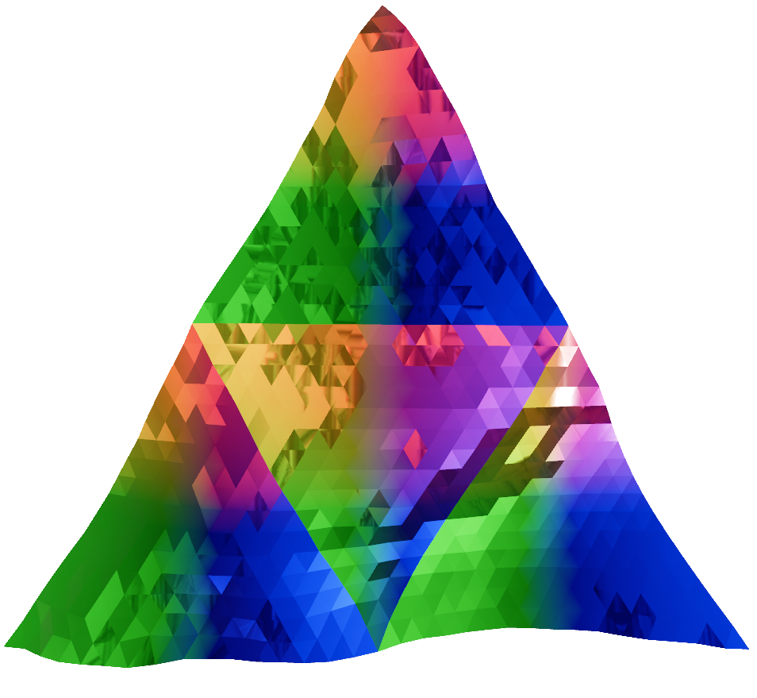

 

  

  <h3 align="center">Triangle_Terrain_Web</h3>

# Triangular tiling mesh for procedurally generated terrain

This project attempts to create procedurally generated terrain using a height map of triangular tilings, instead of the more common square tiling. 

Watch the demo video on YouTube [here](https://youtube.com/watch?v=KJ-jy8l7Py0).

In browser WebGL version playable [here](https://shibaholic.github.io/triangle_terrain_web).

| |
|-|
|
| *Project result; showing triangle tiling terrain.* |

# Why

I was wondering if low poly terrain would look better using triangle tiling or with square tiling. 

| |
|-|
|
| *Example of low poly terrain using square tiling. (Not my work)*|

# Technologies

Rust and the Bevy game engine was used.

# Contents of the project

- Procedural generation for triangle tiling terrain
    - Noise map using [noise.rs](https://crates.io/crates/noise)
    - Multiple coordinate systems (a,b,c tri coord, 2x-1y coord, xy coord)
    - Entire chunk mesh calculated at runtime (inefficient, but oh well)
    - Generation based on distance to player
- 2 different terrain materials
- FPS controller for flying and walking (using [bevy_fps_controller](https://crates.io/crates/bevy_fps_controller))
- Debug menu (using [bevy_egui](https://github.com/vladbat00/bevy_egui))

# Development screenshots

| |
|-|
|
|*1. Visualizing the placement of each chunk. Material color is vertex coordinate applied as vertex color. The white outlines of the triangles are the individual mesh triangles.*|

| |
|-|
|
|*2. Odd and even chunks.*|

| |
|-|
|
|*3. Testing of applying height map (bottom red and black tiles) to mesh.*|

| |
|-|
|
|*4. The height map is not being properly sampled resulting in bad seams between the chunks.*|

| |
|-|
|
|*5. Testing generating a lot of chunks.*|

| |
|-|
|
|*6. Worley noise height map.*|

| |
|-|
|
|*7. Perlin noise height map.*|

| |
|-|
|
|*8. Testing terrain generation distance from player. Red boxes are chunks that are within the radius.*|

| |
|-|
|
|*9. Discovering that the meshes were not being built in the correct direction (which affects PBR and normal maps).*|

| |
|-|
|
|*10. Using green for even and shiny for odd chunks. The "skybox" environment map is visible in the shiny reflection.*|

| |
|-|
|
|*11. A lot of terrain using green shiny material.*|

| |
|-|
|
|*12. Terrain from up and above.*|

| |
|-|
|
|*13. All shiny terrain.*|

| |
|-|
|
|*14. Applying shininess to terrain with vertex color from vertex coordinates.*|

| |
|-|
|
|*15. It looks like candy.*|

| |
|-|
|
|*16. Another view.*|

| |
|-|
|
|*17. Using mesh tri visualizer.*|

| |
|-|
|
|*18. Without.*|

| |
|-|
|
|*19. Reflection visible.*|

| |
|-|
|
|*20. Changed noise generation to large scale and created a custom WGSL vertex shader that changes the vertex color to gray on slopes.*|